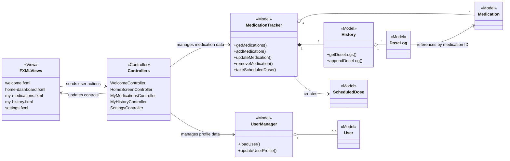

# MyDoseMate

MyDoseMate is a JavaFX desktop application for managing a personal medication
schedule. Users can create a local profile, add and edit medications, record
scheduled doses as taken, review dose history, and view daily adherence
progress. Application data is stored locally in CSV files and does not require
an account, database server, or internet connection after setup.

## Features

- Create and edit a local user profile.
- Add, view, update, and delete medications.
- Store dosage, unit, frequency, scheduled times, start date, supply, and notes.
- Display the doses scheduled for the current day.
- Mark individual scheduled doses as taken.
- Track taken, missed, and upcoming doses in the daily progress summary.
- Review saved dose-history entries.
- Preserve application data between launches using CSV file I/O.
- Display user-friendly messages when validation, file, or navigation errors
  occur.

## Contributors

- Greko Bazana Enrique (`grekobe` / `Shadiczx`)
- Jessica Bibiano (`jessicabibiano`)
- Joelle (`joelle`)
- Tahoora (`tahooranai20-coder`)
- Saif Syed (`SaifSyed786`)
- Elena (`elena-j-s`)

## Architecture

The project follows the Model-View-Controller (MVC) pattern:

- **Model:** Java classes in `model/` manage users, medications, validation,
  schedules, dose history, and CSV persistence.
- **View:** FXML and CSS files in `src/main/resources/.../view/` define the
  application screens and styling.
- **Controller:** JavaFX controllers in `controller/` connect user actions to
  the model and update the views.

### UML Diagram



## Requirements

- IntelliJ IDEA
- A JDK configured in IntelliJ; JDK 25 is recommended for the provided JavaFX
  25 setup
- JavaFX SDK 25.0.2
- Internet access while initially downloading the JDK, JavaFX SDK, or Maven
  dependencies

The application itself does not use the internet after its dependencies are
installed.

## Download JavaFX

1. Download the JavaFX SDK 25.0.2 for your operating system and processor from
   [Gluon JavaFX](https://gluonhq.com/products/javafx/).
2. Extract the downloaded archive to a permanent location on your computer.
3. Locate its `lib` directory. You will use the full path to this directory in
   the IntelliJ run configuration.

Example macOS location:

```text
/Users/your-name/javafx-sdk-25.0.2/lib
```

Example Windows location:

```text
C:\Users\your-name\javafx-sdk-25.0.2\lib
```

## Open the Project in IntelliJ

1. Clone this repository or download and extract its ZIP file.
2. Open IntelliJ IDEA.
3. Select **Open** and choose the repository's root folder—the folder containing
   `pom.xml`, `mvnw`, and this README.
4. If prompted, choose to trust the project.
5. Allow IntelliJ to import the Maven project and finish downloading its
   dependencies.
6. Open **File > Project Structure > Project** and select your installed JDK as
   the Project SDK. JDK 25 is recommended.

## Create the IntelliJ Run Configuration

1. Open **Run > Edit Configurations**.
2. Click **+** to add a new configuration.
3. Choose **Application** from the list.
4. Give the configuration a name such as `MyDoseMate`.
5. Set **Main class** to:

   ```text
   edu.utsa.cs3443.mydosemate.MyDosemateApplication
   ```

6. Set **Use classpath of module** to the MyDoseMate application module.
7. Click **Modify options**.
8. Select **Add VM options** from the dropdown.
9. Enter the following in **VM options**, replacing the example module path with
   the full path to the `lib` directory inside your own JavaFX SDK:

   ```text
   --module-path "/Users/your-name/javafx-sdk-25.0.2/lib" --add-modules javafx.controls,javafx.fxml --enable-native-access=javafx.graphics
   ```

   For example, the original development-machine setting was:

   ```text
   --module-path /Users/grekobe/javafx-sdk-25.0.2/lib --add-modules javafx.controls,javafx.fxml --enable-native-access=javafx.graphics
   ```

   Windows users should replace the module path with their Windows JavaFX
   `lib` path. Keep quotation marks around any path containing spaces.

10. Confirm that **Working directory** is the repository root. It should be the
    folder containing `pom.xml` and `data/`.
11. Click **Apply**, then **OK** to save the configuration.
12. Select the new `MyDoseMate` configuration and click **Run**.

## First Run and Local Data

On the first launch, the application opens the welcome and profile-creation
screens. After a profile is created, later launches open the dashboard.

The application reads and writes these files relative to the repository root:

```text
data/user.csv
data/medications.csv
data/dose_log.csv
```

These live user-data files are generated locally and are intentionally excluded
from Git. This prevents one developer's personal or test data from being shared
with every clone. The committed `data/basic_test_data/` and
`data/complete_test_data/` folders contain sample data used during development.

Do not run the application with a different working directory unless an
equivalent `data/` directory is available there.

## Clean-Clone Validation

1. Clone the repository into a new folder or download a fresh ZIP.
2. Open that new copy in IntelliJ.
3. Recreate the Application run configuration using the instructions above.
4. Run the application and create a user profile.
5. Add, edit, and delete a medication.
6. Mark a scheduled dose as taken and verify that history and progress update.
7. Close and reopen the application and confirm the saved data reloads.
8. Enter invalid or blank form values and confirm validation messages appear.

## Known Issues and Limitations

- Dark mode is not exposed in the interface because theme switching is not
  implemented.
- When a medication is deleted, its retained history entries display
  `Deleted/unknown medication` because dose logs store the medication ID rather
  than a snapshot of its name.
- The dashboard exposes a **Mark Taken** action but does not currently expose a
  separate skip action.
- Data is stored locally for one user. There is no cloud synchronization,
  account login, or multi-user database.
- Automated JUnit coverage has not yet been added; final validation is currently
  performed through the clean-clone workflow above.

## Troubleshooting

### `Module javafx.controls not found`

Confirm that `--module-path` points to the `lib` folder inside the extracted
JavaFX SDK, not to the SDK archive or its parent folder.

### `JavaFX runtime components are missing`

Confirm that the saved IntelliJ configuration is an **Application**
configuration and contains all three VM options shown above.

### The application starts with missing or unexpected data

Confirm that the run configuration's working directory is the repository root.
The application resolves its CSV paths relative to that directory.

### The project does not compile in IntelliJ

Confirm that IntelliJ has imported `pom.xml`, completed the Maven dependency
download, and selected a compatible JDK under **Project Structure**.

### A screen cannot be opened

Rebuild the project and verify that all files under `src/main/resources` are
present in the cloned or extracted repository.
